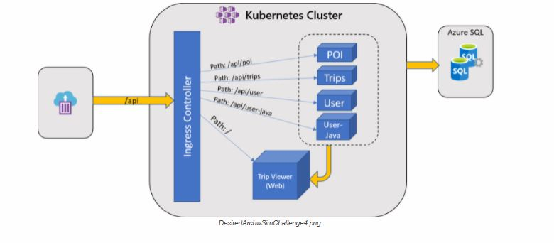

# Putting the Pieces Together

Now that your cluster is connected to your production network and has passed the initial scrutiny of your security team, it’s time to deploy the TripInsights application into the properly configured cluster.

## Challenge

Your team’s goal in this challenge is to deploy the containers from challenge 1 into your cluster. Some security concerns were addressed in the previous challenge, but it’s important to continue to keep security in mind for this challenge (and in the real world!).

### Security

As you deploy your services into your cluster, be mindful of the security requirements mandated by your CTO:

1.  There will be several teams ultimately working on the cluster: the Admin, web development, and API development teams. To prepare for this, the Web and API applications should be deployed into separate namespaces.
2.  You may have noticed the other users in your Active Directory tenant. Lock down user access to your cluster. While you are part of the Admin team and have permissions to access any resource in the cluster, there are two other users from the Web and API teams in your AAD tenant who should only have access to the appropriate namespaces:
    *   **web-dev** user (View access for API resources, Edit access for Web resources).
    *   **api-dev** user (View access to Web resources, Edit access to API resources)
3.  Secrets should be secured in an external vault, not on the cluster. This approach prevents values from being accessed directly by any person without permissions or access to the vault itself.

> **Tip**: Stick to working with **Service Principals** and **NOT pod identities** for this challenge.

### Ingress

Although you have multiple services deployed to the cluster, you will want a single endpoint for your customers to reach. To do this, create an ingress controller and configure the ingress rules to route to the appropriate services. The **References** section contains more information on the paths for the different components.

In order to validate that your application is working as expected, you will need to submit a single endpoint (`http://endpoint.you.provide`) to a provided simulator. The simulator will start sending traffic to the APIs once you provide your endpoint. It expects to make calls to the APIs by name (`http://endpoint.you.provide/api/trips` for example). You can see data start to flow through your app via the Trip Viewer application. The simulator is deployed as a container instance in your subscription and you will find the URL for the simulator in the **Messages** tab of your OpenHack portal.

### Desired Architecture

## Success Criteria

*   **Your team** successfully deployed the TripInsights application into the cluster
*   **Different members** of your team must be able to connect to your cluster using the **api-dev** and **web-dev** AAD users and demonstrate appropriate access levels
*   **Your team** secured your Azure SQL Server connection information such that literal values cannot be inappropriately accessed
*   **Your team** used an external key vault to store and access secrets inside your cluster
*   **Your team** ensured that all links on the Trip Viewer site are reachable
*   **Your team** ensured the simulator can successfully update the values in the application across all services

## References

### Links

API paths reference

*   [Trip Viewer](https://github.com/Azure-Samples/openhack-containers/tree/master/src/tripviewer#paths)
*   [Points of Interest API](https://github.com/Azure-Samples/openhack-containers/tree/master/src/poi#api-paths)
*   [Trip API](https://github.com/Azure-Samples/openhack-containers/tree/master/src/trips#api-paths)
*   [User API](https://github.com/Azure-Samples/openhack-containers/tree/master/src/user-java#api-paths)
*   [User Profile API](https://github.com/Azure-Samples/openhack-containers/tree/master/src/userprofile#api-paths)

API configuration reference

*   [Points of Interest API](https://github.com/Azure-Samples/openhack-containers/tree/master/src/poi#configuration)
*   [Trip API](https://github.com/Azure-Samples/openhack-containers/tree/master/src/trips#configuration)
*   [User API](https://github.com/Azure-Samples/openhack-containers/tree/master/src/user-java#configuration)
*   [User Profile API](https://github.com/Azure-Samples/openhack-containers/tree/master/src/userprofile#configuration)

Azure Kubernetes Service (AKS)

*   [Secret Store CSI driver](https://github.com/Azure/secrets-store-csi-driver-provider-azure)
*   [Ingress Controllers](https://docs.microsoft.com/en-us/azure/aks/concepts-network#ingress-controllers)
*   [Create an NGINX ingress controller in AKS](https://docs.microsoft.com/en-us/azure/aks/ingress-basic)
*   [Best Practices for Cluster Security](https://docs.microsoft.com/en-us/azure/aks/operator-best-practices-cluster-security)
*   [Access and identity options](https://docs.microsoft.com/en-us/azure/aks/concepts-identity#role-based-access-controls-rbac)
*   [Using RBAC Authorization in Kubernetes](https://docs.microsoft.com/en-us/azure/aks/azure-ad-rbac)

Kubernetes

*   [Kubectl overview](https://kubernetes.io/docs/user-guide/kubectl-overview/)
*   [Kubernetes core concepts](https://docs.microsoft.com/en-us/azure/aks/concepts-clusters-workloads)
*   [Kubernetes Namespaces](https://kubernetes.io/docs/concepts/overview/working-with-objects/namespaces/)
*   [Kubernetes RBAC Controls](https://kubernetes.io/docs/reference/access-authn-authz/rbac/)

Azure

*   [Resource naming conventions](https://docs.microsoft.com/en-us/azure/architecture/best-practices/naming-conventions)
*   [Azure CLI reference](https://docs.microsoft.com/en-us/cli/azure/get-started-with-azure-cli)
