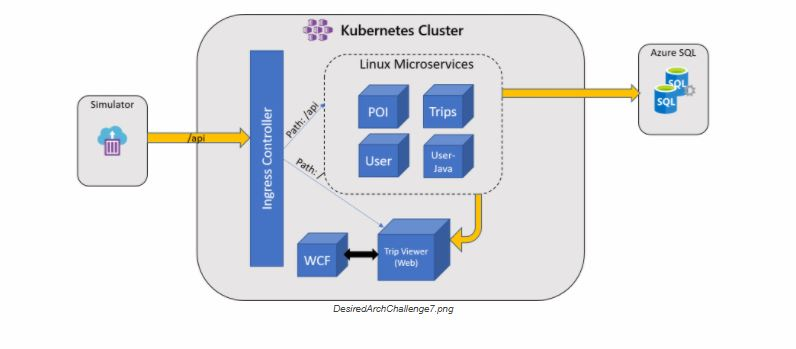

# Mixed Emotions

We interrupt your regular programming with this special announcement:

Your company has acquired a company and you need to deploy some of its workloads into your cluster. One of the services is a Windows Communication Foundation (WCF) service, which calculates new policy prices based on driver data. Prior to the acquisition, the company experimented with containerizing this service and succeeded in running it on Docker. In order to take advantage of Kubernetes for additional orchestration, you will need to deploy this service alongside the rest of your Linux services and update the web app to communicate with the new service.

## Challenge

Your team’s challenge is to deploy this new service along with the rest of the application into a single cluster without making changes to previous deployment files. Your team must also ensure the new service is integrated into the TripInsights application by upgrading the Trip Viewer application to use a different image that has already been deployed to your registry: _tripviewer2:1.0_. This application calls out to the WCF service in your cluster.

### Things to think about

Much of what you’ve accomplished so far has given you the tools you need to incorporate this new service, however mixed workloads on Kubernetes and AKS can require you think differently about your overall cluster deployment, making sure it’s configured to support both OS types. Here are some questions to ask yourself when considering the addition of Windows workloads:

*   What are the cluster features required to support Windows?
*   How do you control the deployment to ensure Windows containers are directed to appropriate nodes?
*   Are there changes to your cluster’s networking when adding Windows nodes to AKS?

### About the Windows Service

The new service is a Windows Communication Foundation (WCF) service. It is already pushed to your registry as _wcfservice:1.0_ and listens on port 80 for requests.

### About Trip Viewer 2

The updated Trip Viewer app expects an environment variable, WCF_ENDPOINT, in order to communicate with the service. You can test the communication by navigating to the UserProfile page of the app and clicking the ProcessRequest button for a user, which calls out to the WCF service and receives a response. If nothing happens, something isn’t right.

### Desired Architecture

## Success Criteria

*   **Your team** successfully deployed the WCF application into the same AKS cluster as your Linux workloads
*   **Your team** ensured that previous deployments are unchanged and unaffected
*   **Your team** ensured that the updated Trip Viewer web app can successfully communicate with the WCF service
*   **Your team** must demonstrate your cluster is overall “Healthy”

## References

*   [Windows Containers in Kubernetes](https://kubernetes.io/docs/setup/production-environment/windows/intro-windows-in-kubernetes/)
*   [Multiple Node Pools in AKS](https://docs.microsoft.com/en-us/azure/aks/use-multiple-node-pools)
*   [Windows on AKS](https://docs.microsoft.com/en-us/azure/aks/windows-container-cli)
*   [About Windows Containers](https://docs.microsoft.com/en-us/virtualization/windowscontainers/about/)
*   [Configuring Azure CNI with AKS](https://docs.microsoft.com/en-us/azure/aks/configure-azure-cni)

