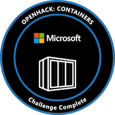

# Containers 2.0 Openhack

<!-- 
Guidelines on README format: https://review.docs.microsoft.com/help/onboard/admin/samples/concepts/readme-template?branch=master

Guidance on onboarding samples to docs.microsoft.com/samples: https://review.docs.microsoft.com/help/onboard/admin/samples/process/onboarding?branch=master

Taxonomies for products and languages: https://review.docs.microsoft.com/new-hope/information-architecture/metadata/taxonomies?branch=master
-->

This repo houses the source code and dockerfiles for the Containers OpenHack event.

The application used for this event is a heavily modified and recreated version of the original [My Driving application](https://github.com/Azure-Samples/MyDriving).

## Challenges

- [Challenge 1 But First, Containers](./Challenge-1-Instructions.md) - [Challenge  1 Solution](https://github.com/kdcllc/openhack-containers-2021/blob/challenge-1/Challenge-2-Solution.md) 

- [Challenge 2 Getting Ready for Orchestration](./Challenge-2-Instructions.md) - [Challenge 2 Solution](https://github.com/kdcllc/openhack-containers-2021/blob/challenge-2/Challenge-2-Solution.md) 

- [Challenge 3 To Orchestration and Beyond](./Challenge-3-Instructions.md) - [Challenge 3 Solution](https://github.com/kdcllc/openhack-containers-2021/blob/challenge-3/Challenge-3-Solution.md) 

- [Challenge 4 Putting the Pieces Together](./Challenge-4-Instructions.md) - [Challenge 4 Solution](https://github.com/kdcllc/openhack-containers-2021/blob/challenge-4/Challenge-4-Solution.md) 

- [Challenge 5 Wait, What’s Happening](./Challenge-5-Instructions.md)

- [Challenge 6 Locking it Down](./Challenge-6-Instructions.md)

- [Challenge 7 Mixed Emotions](./Challenge-7-Instructions.md)

- [Challenge 8 Doing More with Service Mesh](./Challenge-8-Instructions.md)

- [Using Ngnix Ingress Controller](./ngnix-ingress.md)

## Contents

| File/folder       | Description                                |
|-------------------|--------------------------------------------|
| `.devcontainer`   | VS Code [development container](https://code.visualstudio.com/docs/remote/containers) with useful utils (Azure CLI, Kubectl, Helm, etc.)   |
| `dockerfiles`     | Dockerfiles for source code                |
| `src`             | Sample source code for POI, Trips, User (Java), UserProfile (Node.JS), and TripViewer                     |
| `.gitignore`      | Define what to ignore at commit time.      |
| `CODE_OF_CONDUCT.md` | Code of conduct.                        |
| `LICENSE`         | The license for the sample.                |

## Contributing

This project welcomes contributions and suggestions.  Most contributions require you to agree to a
Contributor License Agreement (CLA) declaring that you have the right to, and actually do, grant us
the rights to use your contribution. For details, visit https://cla.opensource.microsoft.com.

When you submit a pull request, a CLA bot will automatically determine whether you need to provide
a CLA and decorate the PR appropriately (e.g., status check, comment). Simply follow the instructions
provided by the bot. You will only need to do this once across all repos using our CLA.

This project has adopted the [Microsoft Open Source Code of Conduct](https://opensource.microsoft.com/codeofconduct/).
For more information see the [Code of Conduct FAQ](https://opensource.microsoft.com/codeofconduct/faq/) or
contact [opencode@microsoft.com](mailto:opencode@microsoft.com) with any additional questions or comments.
 